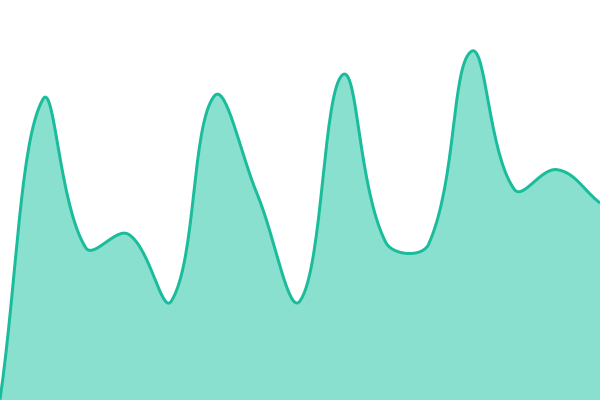
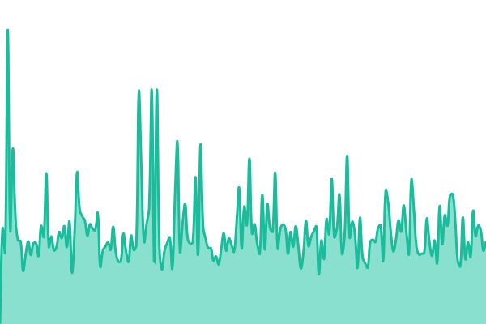
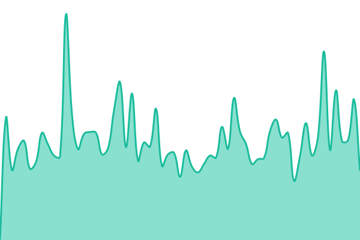
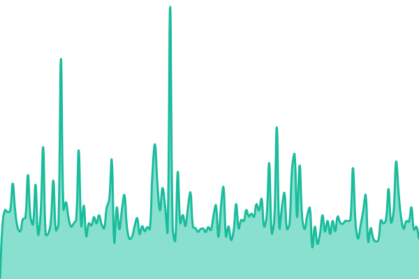
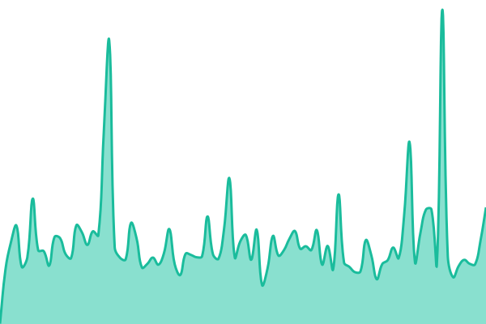
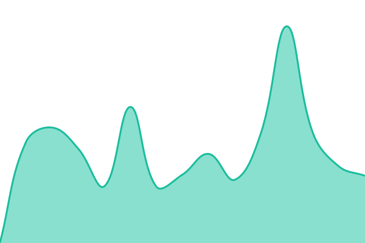

# [📈 Live Status](https://status.datasmart.com.co): <!--live status--> **🟨 Degraded performance**

This repository contains the open-source uptime monitor and status page for [Alex López](https://status.datasmart.com.co), powered by [Upptime](https://github.com/upptime/upptime).

With [Upptime](https://upptime.js.org), you can get your own unlimited and free uptime monitor and status page, powered entirely by a GitHub repository. We use [Issues](https://github.com/alopezja/datasmart-status/issues) as incident reports, [Actions](https://github.com/alopezja/datasmart-status/actions) as uptime monitors, and [Pages](https://status.datasmart.com.co) for the status page.

<!--start: status pages-->
<!-- This summary is generated by Upptime (https://github.com/upptime/upptime) -->
<!-- Do not edit this manually, your changes will be overwritten -->
<!-- prettier-ignore -->
| URL | Status | History | Tiempo de respuesta | Disponibilidad |
| --- | ------ | ------- | ------------- | ------ |
|  [Ventix](https://www.datasmart.com.co/api/health/ventix) | Degradado | [ventix.yml](https://github.com/alopezja/datasmart-status/commits/HEAD/history/ventix.yml) | 

 1872ms
     
 | 

<a href="https://status.datasmart.com.co/history/ventix">99.96%</a>
    

|  [Axia](https://www.datasmart.com.co/api/health/axia) | Degradado | [axia.yml](https://github.com/alopezja/datasmart-status/commits/HEAD/history/axia.yml) | 

 1643ms
     
 | 

<a href="https://status.datasmart.com.co/history/axia">99.97%</a>
    

|  [DataSmart Chat](https://www.datasmart.com.co/api/health/dschat) | Degradado | [data-smart-chat.yml](https://github.com/alopezja/datasmart-status/commits/HEAD/history/data-smart-chat.yml) | 

 1622ms
     
 | 

<a href="https://status.datasmart.com.co/history/data-smart-chat">99.97%</a>
    

|  [Servix](https://www.datasmart.com.co/api/health/servix) | Degradado | [servix.yml](https://github.com/alopezja/datasmart-status/commits/HEAD/history/servix.yml) | 

 1630ms
     
 | 

<a href="https://status.datasmart.com.co/history/servix">99.98%</a>
    

|  [Mindix](https://www.datasmart.com.co/api/health/mindix) | Degradado | [mindix.yml](https://github.com/alopezja/datasmart-status/commits/HEAD/history/mindix.yml) | 

 1628ms
     
 | 

<a href="https://status.datasmart.com.co/history/mindix">99.99%</a>
    

|  [Bridge](https://www.datasmart.com.co/api/health/bridge) | Degradado | [bridge.yml](https://github.com/alopezja/datasmart-status/commits/HEAD/history/bridge.yml) | 

 1658ms
     
 | 

<a href="https://status.datasmart.com.co/history/bridge">100.00%</a>
    

<!--end: status pages-->

[**Visit our status website →**](https://status.datasmart.com.co)

## 📄 License

- Powered by: [Upptime](https://github.com/upptime/upptime)
- Code: [MIT](./LICENSE) © [Anand Chowdhary](https://anandchowdhary.com)
- Data in the `./history` directory: [Open Database License](https://opendatacommons.org/licenses/odbl/1-0/)
